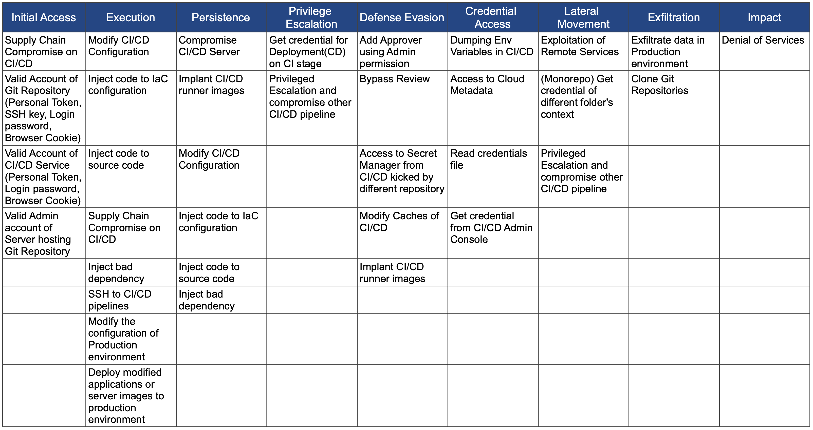
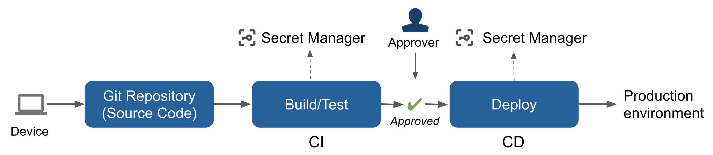

# Common Threat Matrix for CI/CD Pipeline
This is an ATT&CK-like matrix focus on CI/CD Pipeline specific risk.  
[MITRE ATT&CK®](https://attack.mitre.org/) is a knowledge base of adversary tactics and techniques.  
To map the threat of CI/CD Pipeline, I use the same classification as the framework.  
(Feedback is welcome)  

## Table of Contents
- [Background](#background)
- [Threat Matrix](#threat-matrix)
- [Components of CI/CD](#components-of-cicd)
- [Techniques and Mitigation](#techniques-and-mitigation)
    - [Initial Access](#initial-access)
    - [Execution](#execution)
    - [Execution (Production)](#execution-production)
    - [Persistence](#persistence)
    - [Privilege Escalation](#privilege-escalation)
    - [Defense Evasion](#defense-evasion)
    - [Credential Access](#credential-access)
    - [Lateral Movement](#lateral-movement)
    - [Exfiltration](#exfiltration)
    - [Impact](#impact)
- [Common Question](#common-question)
    - [Supply-chain attacks are the only risk of CI/CD pipeline, correct?](#supply-chain-attacks-are-the-only-risk-of-cicd-pipeline-correct)

## Background
This threat map is published in conjunction to the presentation “[Attacking and Securing CI/CD Pipeline](https://speakerdeck.com/rung/cd-pipeline)” at CODE BLUE 2021 Opentalks.  
The purpose of this matrix is to share knowledge on securing CI/CD environments with Cybersecurity community.  
This matrix was created by Mercari Security Team, and reviewed by Platform Team.  

## Threat Matrix

## Components of CI/CD

| Name                   | Tools                                                                                                                               |
|------------------------|-------------------------------------------------------------------------------------------------------------------------------------|
| Device                 | - Developer Workstation: Mac/Win/Cloud-based                                                                                        |
| Git Repository Service | - GitHub, GitLab                                                                                                                    |
| CI                     | - CI/CD Services (e.g. CircleCI, Cloud Build, Codebuild, GitHub Actions)                                                            |
| CD                     | - CI/CD Services (e.g. CircleCI, Cloud Build, Codebuild, GitHub Actions)  - CD Services (e.g. Spinnaker, ArgoCD)                 |
| Secret Management      | - Secret Management Services (e.g. AWS Secret Manager, GCP Secret Manager, Hashicorp Vault)                                         |
| Production environment | - Cloud Services (e.g AWS, Google Cloud, Microsoft Azure)  - Other Resources (e.g. Container Registry, Linux Server, Kubernetes) |

## Techniques and Mitigation
### Initial Access

<table>
  <tr>
   <td>Techniques
   </td>
   <td>Description
   </td>
   <td>Mitigation
   </td>
  </tr>
  <tr>
   <td>Supply Chain Compromise on CI/CD
   </td>
   <td>Supply Chain Attacks to Application Library, Tools, Container Images in CI/CD Pipelines.
   </td>
   <td>
<ol>

<li>(CI, CD) Limit egress connection via Proxy or IP Restriction

<li>(CI, CD) Audit Logging of the activities

<li>(CI, CD) Security Monitoring using IDS/IPS, and EDR

<li>(CI, CD) Check each tool’s Integrity

<li>(CI, CD) Doesn’t allow untrusted libraries, tools
</li>
</ol>
   </td>
  </tr>
  <tr>
   <td>Valid Account of Git Repository

(Personal Token, SSH key, Login password, Browser Cookie)
   </td>
   <td>Use developer’s credentials to access to Git Repository Service \
(Personal token, SSH key, browser cookie, or login password is stolen)
   </td>
   <td>
<ol>

<li>(Device) Device security is out of scope

<li>(Git Repository) Network Restriction

<li>(Git Repository) Limit access permission of each developer (e.g. no write permission, limited read permission)

<li>(CI, CD) Use GitHub App and enable IP restriction
</li>
</ol>
   </td>
  </tr>
  <tr>
   <td>Valid Account of CI/CD Service

(Personal Token, Login password, Browser Cookie)
   </td>
   <td>Use SSH key or Tokens to access to CI/CD Service Servers directly
   </td>
   <td>
<ol>

<li>(CI, CD) Strict access control to CI/CD pipeline servers

<li>(CI, CD) Hardening CI/CD pipeline servers
</li>
</ol>
   </td>
  </tr>
  <tr>
   <td>Valid Admin account of Server hosting Git Repository
   </td>
   <td>Use SSH key, Tokens to access to Server hosting Git Repository
   </td>
   <td>
<ol>

<li>(Git Repository) Strict access control to server hosting Git Repository

<li>(Git Repository) Hardening git repository servers
</li>
</ol>
   </td>
  </tr>
</table>

### Execution

<table>
  <tr>
   <td>Techniques
   </td>
   <td>Description
   </td>
   <td>Mitigation
   </td>
  </tr>
  <tr>
   <td>Modify CI/CD Configuration
   </td>
   <td>Modify CI/CD Configuration on Git Repository

(CircleCI: .circleci/config.yml, CodeBuild: buildspec.yml, CloudBuild: cloudbuild.yaml, GitHub Actions: .github/workflows/*.yaml)
   </td>
   <td>
<ol>

<li>(Git Repository) Only allow pushing of signed commits

<li>(CI, CD) Disallow CI/CD config modification without review (CI/CD must not follow changes of a branch without review)

<li>(CI, CD) Add signature to CI/CD config and verify it

<li>(CI, CD) Limit egress connections via Proxy and IP restrictions

<li>(CI, CD) Audit Logging of activities

<li>(CI, CD) Security Monitoring using IDS/IPS, and EDR
</li>
</ol>
   </td>
  </tr>
  <tr>
   <td>Inject code to IaC configuration
   </td>
   <td>For example, Terraform allows code execution and file inclusion. The code is executed during CI(plan stage)

Code Execution: Provider installation(put provider binary with .tf), Use External provider  
File inclusion: file Function
   </td>
   <td>
<ol>

<li>(Git Repository) Only allow pushing of signed commits

<li>(CI, CD) Restrict dangerous code through Policy as Code

<li>(CI, CD) Restrict untrusted providers

<li>(CI, CD) Limit egress connections via Proxy and IP restrictions

<li>(CI, CD) Audit Logging of activities

<li>(CI, CD) Security Monitoring using IDS/IPS, and EDR
</li>
</ol>
   </td>
  </tr>
  <tr>
   <td>Inject code to source code
   </td>
   <td>Application executes test code during CI
   </td>
   <td>
<ol>

<li>(CI, CD) Restrict dangerous code through Policy as Code

<li>(CI, CD) Limit egress connections via Proxy and IP restrictions

<li>(CI, CD) Audit Logging of the activities

<li>(CI, CD) Security Monitoring using IDS/IPS, and EDR
</li>
</ol>
   </td>
  </tr>
  <tr>
   <td>Supply Chain Compromise on CI/CD
   </td>
   <td>(Repeated)
   </td>
   <td>
   </td>
  </tr>
  <tr>
   <td>Inject bad dependency
   </td>
   <td>Inject bad dependency
   </td>
   <td>
<ol>

<li>(CI, CD) Code checks by SCA(Security Compliance Associates)

<li>(CI, CD) Restrict untrusted libraries, and tools

<li>(CI, CD) Limit egress connections via Proxy and IP restrictions

<li>(CI, CD) Audit Logging of activities

<li>(CI, CD) Security Monitoring using IDS/IPS, and EDR
</li>
</ol>
   </td>
  </tr>
  <tr>
   <td>SSH to CI/CD pipelines
   </td>
   <td>Connect to CI/CD pipeline servers via SSH or Valid Token
   </td>
   <td>
<ol>

<li>(CI, CD) Implement strict access control to CI/CD pipeline servers

<li>(CI, CD) Disallow SSH access
</li>
</ol>
   </td>
  </tr>
</table>

### Execution (Production)

<table>
  <tr>
   <td>Techniques
   </td>
   <td>Description
   </td>
   <td>Mitigation
   </td>
  </tr>
  <tr>
   <td>Modify the configuration of Production environment
   </td>
   <td>Modify the configuration of Production environment via stolen credentials
   </td>
   <td>
<ol>

<li>(Secret Manager) Rorate credentials regularly or issue temporary tokens only

<li>(Production environment) Network Restriction to Cloud API

<li>(Production environment) Enable Audit Logging

<li>(Production environment) Security Monitoring of data access

<li>(Production environment) Enforce principle of least privilege to issued credentials

<li>(Production environment) Rate limiting
</li>
</ol>
   </td>
  </tr>
  <tr>
   <td>Deploy modified applications or server images to production environment
   </td>
   <td>Deploy modified applications or server images (e.g. container image, function, VM image) to production environment via stolen credentials
   </td>
   <td>
<ol>

<li>(Secret Manager) Rorate credentials regularly or issue temporary tokens only

<li>(Git Repository) Require multi-party approval(peer review)

<li>(Production environment) Verify signature of artifacts

<li>(Production environment) Network Restriction to Cloud API

<li>(Production environment) Enable Audit Logging

<li>(Production environment) Security Monitoring of deployment

<li>(Production environment) Enforce principle of least privilege to issued credentials

<li>(Production environment) Rate limiting
</li>
</ol>
   </td>
  </tr>
</table>

### Persistence

<table>
  <tr>
   <td>Techniques
   </td>
   <td>Description
   </td>
   <td>Mitigation
   </td>
  </tr>
  <tr>
   <td>Compromise CI/CD Server
   </td>
   <td>Compromise CI/CD Server from pipeline
   </td>
   <td>
<ol>

<li>(CI, CD) Clean environment created on every pipeline run
</li>
</ol>
   </td>
  </tr>
  <tr>
   <td>Implant CI/CD runner images
   </td>
   <td>Implant container images for CI/CD with malicious code to establish persistence
   </td>
   <td>
<ol>

<li>Use signed/trusted CI runners only

<li>Implement strict access controls to container registry

<li>(CI, CD) Audit Logging of activities
</li>
</ol>
   </td>
  </tr>
  <tr>
   <td>(Modify CI/CD Configuration)
   </td>
   <td>(Repeated)
   </td>
   <td>
   </td>
  </tr>
  <tr>
   <td>(Inject code to IaC configuration)
   </td>
   <td>(Repeated)
   </td>
   <td>
   </td>
  </tr>
  <tr>
   <td>(Inject code to source code)
   </td>
   <td>(Repeated)
   </td>
   <td>
   </td>
  </tr>
  <tr>
   <td>(Inject bad dependency)
   </td>
   <td>(Repeated)
   </td>
   <td>
   </td>
  </tr>
</table>

### Privilege Escalation

<table>
  <tr>
   <td>Techniques
   </td>
   <td>Description
   </td>
   <td>Mitigation
   </td>
  </tr>
  <tr>
   <td>Get credential for Deployment(CD) on CI stage
   </td>
   <td>Get high privilege credential in CI stage (not CD)
   </td>
   <td>
<ol>

<li>(CI, CD) Limit the scope of credentials in each step.

<li>(CI) Always enforce Least Privilege. CI(not CD) must not have credentials for deployment

<li>(CI, CD) Use different Identities between CI and CD

<li>(CI, CD) Maintain strong isolation between CI and CD
</li>
</ol>
   </td>
  </tr>
  <tr>
   <td>Privileged Escalation and compromise other CI/CD pipeline
   </td>
   <td>Privilege Escalation from CI/CD Environment to other components
   </td>
   <td>
<ol>

<li>(CI, CD) Hardening of CI/CD pipeline servers 

<li>(CI, CD) Isolate CI/CD pipeline from other systems.
</li>
</ol>
   </td>
  </tr>
</table>

### Defense Evasion

<table>
  <tr>
   <td>Techniques
   </td>
   <td>Description
   </td>
   <td>Mitigation
   </td>
  </tr>
  <tr>
   <td>Add Approver using Admin permission
   </td>
   <td>Change Approver using Git Repository Service Admin permission
   </td>
   <td>
<ol>

<li>(Git Repository) Limit admin users

<li>(Git Repository) Require multi-party approval(peer review)
</li>
</ol>
   </td>
  </tr>
  <tr>
   <td>Bypass Review
   </td>
   <td>Bypass Peer Review of Git Repository
   </td>
   <td>
<ol>

<li>(Git Repository) Restrict repository admin from pushing to main branch without a review

<li>(CD) Require additional approval from reviewer to kick CD
</li>
</ol>
   </td>
  </tr>
  <tr>
   <td>Access to Secret Manager from CI/CD kicked by different repository
   </td>
   <td>Use a CI/CD system in a different repository to leverage stolen credentials to access secret manager
   </td>
   <td>
<ol>

<li>(Secret Manager) Restrict and separate access from different workloads
</li>
</ol>
   </td>
  </tr>
  <tr>
   <td>Modify Caches of CI/CD
   </td>
   <td>Implant bad code to caches of CI/CD pipeline
   </td>
   <td>
<ol>

<li>(CI, CD) Clean environment on every pipeline run
</li>
</ol>
   </td>
  </tr>
  <tr>
   <td>Implant CI/CD runner images
   </td>
   <td>(Repeated)
   </td>
   <td>
   </td>
  </tr>
</table>

### Credential Access

<table>
  <tr>
   <td>Techniques
   </td>
   <td>Description
   </td>
   <td>Mitigation
   </td>
  </tr>
  <tr>
   <td>Dumping Env Variables in CI/CD
   </td>
   <td>Dump Environment Variables in CI/CD
   </td>
   <td>
<ol>

<li>(CI, CD) Don’t use environment variables for storing credentials

<li>(Secret Manager) Use secret manager which has network restriction

<li>(Secret Manager) Enable Audit Logging

<li>(Secret Manager) Security Monitoring to detect malicious activity

<li>(Secret Manager) Rorate credentials regularly or issue temporary tokens only

<li>(CI, CD) Enable Audit Logging

<li>(CI, CD) Security Monitoring using IDS/IPS, and EDR
</li>
</ol>
   </td>
  </tr>
  <tr>
   <td>Access to Cloud Metadata
   </td>
   <td>Access to Cloud Metadata to get access token of Cloud resources
   </td>
   <td>
<ol>

<li>(CI, CD) Restrict metadata access from suspicious processes

<li>(Secret Manager) Use secret manager which has network restriction

<li>(Secret Manager) Enable Audit Logging

<li>(Secret Manager) Security Monitoring to detect malicious activity

<li>(Secret Manager) Rorate credentials regularly or issue temporary tokens only

<li>(CI, CD) Enable Audit Logging

<li>(CI, CD) Security Monitoring using IDS/IPS, and EDR
</li>
</ol>
   </td>
  </tr>
  <tr>
   <td>Read credentials file
   </td>
   <td>Read credentials file mounted in CI/CD pipeline
   </td>
   <td>
<ol>

<li>(CI, CD) Disable or mask contents of files in results of CI/CD

<li>(Secret Manager) Use secret manager which has network restriction

<li>(Secret Manager) Enable Audit Logging

<li>(Secret Manager) Security Monitoring to detect malicious activity

<li>(Secret Manager) Rorate credentials regularly or issue temporary tokens only

<li>(CI, CD) Enable Audit Logging

<li>(CI, CD) Security Monitoring using IDS/IPS, and EDR
</li>
</ol>
   </td>
  </tr>
  <tr>
   <td>Get credential from CI/CD Admin Console
   </td>
   <td>See credential from CI/CD admin console
   </td>
   <td>
<ol>

<li>(CI, CD) Doesn’t use CI/CD services that expose credentials from the system console
</li>
</ol>
   </td>
  </tr>
</table>

### Lateral Movement

<table>
  <tr>
   <td>Techniques
   </td>
   <td>Description
   </td>
   <td>Mitigation
   </td>
  </tr>
  <tr>
   <td>Exploitation of Remote Services
   </td>
   <td>Exploit services from CI/CD Pipeline
   </td>
   <td>
<ol>

<li>(CI, CD) Isolate CI/CD pipeline systems from other services
</li>
</ol>
   </td>
  </tr>
  <tr>
   <td>(Monorepo) Get credential of different folder's context
   </td>
   <td>In monorepo architecture of Git Repository, there are many approvers.

Need to set access controls carefully
   </td>
   <td>
<ol>

<li>(Git Repository) Set approver for each folder

<li>(CI, CD, Secret Manager) Avoid sharing CI/CD environment and credentials between different folders. 

<li>(CI, CD) should be isolated by environment folder or context
</li>
</ol>
   </td>
  </tr>
  <tr>
   <td>Privileged Escalation and compromise other CI/CD pipeline

(Repeated)
   </td>
   <td>
   </td>
   <td>
   </td>
  </tr>
</table>

### Exfiltration

<table>
  <tr>
   <td>Techniques
   </td>
   <td>Description
   </td>
   <td>Mitigation
   </td>
  </tr>
  <tr>
   <td>Exfiltrate data in Production environment
   </td>
   <td>Exfiltrate data in Production environment via stolen credentials
   </td>
   <td>
<ol>

<li>(CI/CD) Doesn’t put data access credential in CI/CD

<li>(Production environment) Network Restriction to Cloud API

<li>(Production environment) Enable Audit Logging

<li>(Production environment) Security Monitoring of data access

<li>(Production environment) Enforce principle of least privilege to issued credentials

<li>(Production environment) Rate limiting
</li>
</ol>
   </td>
  </tr>
  <tr>
   <td>Clone Git Repositories
   </td>
   <td>Exfiltrate data from Git Repositories
   </td>
   <td>
<ol>

<li>(Git Repository) Network Restriction

<li>(Git Repository) Use temporary tokens instead of long life static tokens

<li>(Git Repository) Limit access permission of each developer (e.g. no write permission, limited read permission)

<li>(Git Repository) Enable Audit Logging

<li>(Git Repository) Security Monitoring of data access

<li>(Git Repository) Rate limiting
</li>
</ol>
   </td>
  </tr>
</table>

### Impact

<table>
  <tr>
   <td>Techniques
   </td>
   <td>Description
   </td>
   <td>Mitigation
   </td>
  </tr>
  <tr>
   <td>Denial of Services
   </td>
   <td>Denial of Services of CI/CD pipeline
   </td>
   <td>
<ol>

<li>(CI, CD) Scalable Infrastructure
</li>
</ol>
   </td>
  </tr>
</table>

  
## Common Question
### Supply-chain attacks are the only risk of CI/CD pipeline, correct?

Supply-chain attacks are one of the most serious risks. But it is not the only risk for CI/CD Pipelines. The entire attack surface need to be considered. You can check my slide: “[Attacking and Securing CI/CD Pipeline](https://speakerdeck.com/rung/cd-pipeline)” to know risks of CI/CD pipeline

